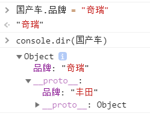

# 原型与原型链

**原型？类型吧？是不是写错了，原型是什么毛玩意儿？**

难道你说的不是类型么，CLASS么，类再生成实例么？打错字了吧，怎么是原型？

我说的没错，就是原型，不是类型。在Javascript中，不久以前，没有“类”这个虚拟的概念。所有的对象都是“实例”，非常类似于现实世界中的样子。到这你可能有点confusing，请往下看。

```
但是：自从有了ES6之后，Javascript就也有了类class的概念了，
稍后再说这个。因为虽然有的类这个概念和保留字，但是实际上，他
TMD底层还是用原来的“原型”方式去实现的。
```

##     先说两件事：在JS的世界中，原则1：除基本数据类型外，万物皆实例，原则2：构成万物的基本物体有两种，空的function\(\)和空的object，其余物体都是构造在这两种物体之上。

OK到这里，举个生活中的例子：（前方高能，例子很长，请准备好4倍耐心）

1. 你想要做一道宫保鸡丁，所以你真真切切的写了一个”菜谱”：里面包含了菜和调料的名称，用量和制作方法.  （注意是真写了一个，不是脑子里虚构了一个，JS世界里不虚构，都是来真的）。

```text
function GongBaoJiDing()
{
    this.菜名 = "GBJD";
    this.主料 = "鸡肉";
    this.蔬菜 = "红萝卜";
    this.制作方法 = function() {return "ok";}
}
```

 既然要真写， 这里就涉及到一个问题，你这个_**菜谱写在哪**_？纸上？电脑里？ 假设是纸上，OK，你拿来了**一张白纸，这张白纸就是空function\(\)**，写下了上述**代码**。

 2. 现在有了菜谱了，那么你要真的做成这道菜了，如下代码：

```text
var GBJD_试做 = new GongBaoJiDing();
```

 要实实在在的做它，**照着那个“菜谱”，拿来一些空Object**, 来做成 `GBJD_试做` 这道菜。

看到这里估计还是很晕，我们来总结一下：

| 我们起的土名字： | 制作方法function GongBaoJiDing\(\) | 菜GBJD\_试做 |
| :--- | :--- | :--- |
| 正规名称： | 构造函数 | 实例 |
| 本身是什么： | 写在白纸\(空function\(\)\)上的方法 | _1.是一个有主料有蔬菜的菜   2. 是基于菜谱的指示，拿空物体按菜谱制成的。_ |
| 构造能力： | 有prototype（翻译：制造样品）能力 | 无prototype（翻译：制造样品）能力 |

有人问：菜谱什么时候告诉你拿空object来做了？你吹牛逼哦，请看下面，别急。

我们在chrome控制台敲一下看看：



_上图就看到了function GongBaoJiDing\(\)的内部构成，它有一个制造属性叫prototype，其中有一份制造方法就是它本身，其中还有一个\_\_proto\_\_是Object表明制造的时候要拿空物体来造。_

_function GongBaoJiDing\(\)还有个\_\_proto\_\_属性是一个空函数表明它是从何而来，说明这个菜谱本身，是写在一个空函数上面的，菜谱本身的原材料是一个空函数。_

_那我们在chrome控制台敲一下`GBJD_试做` 看一下喽：_


大家看到没，这玩意儿是可追溯的喔，有质量保证的喔，它不仅是有主料，有蔬菜，有制作方法的一道菜，而且它还有个\_\_proto\_\_属性，表明它是从何而来。我们可以很清楚的看到它是按照constructor里的构造函数，由空物体造出来的。

综上： prototype是有制造能力的function才具备的属性，它里面放的是制作方法，和基于什么东西制作。

             而\_\_proto\_\_表明了这个物体本身从何而来。

你要是愿意，你可以把prototype这个制造样品的能力扩充一下，比如你可以说你要添加一个要求：“火力中火慢烧” （老板要打屎你喔）。

```text
GongBaoJiDing.prototype.火力 = "中火慢烧"；
```


看到了没？你可以加额外的制造要求的喔，是不是很神奇。

最神奇的是这个时候已经造出来的那盘菜，\_\_proto\_\_也是中火慢烧的喽，明明我们是先做出来才加的要求嘛。。。


没有办法喔，因为旧菜谱不会保留的喔，只会保留最新的，已经造出来的不管喔，因为你这是在追溯我的制造工艺喔, 追溯的可不是之前你是怎么做出来的喔。

